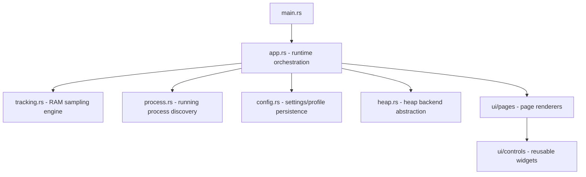
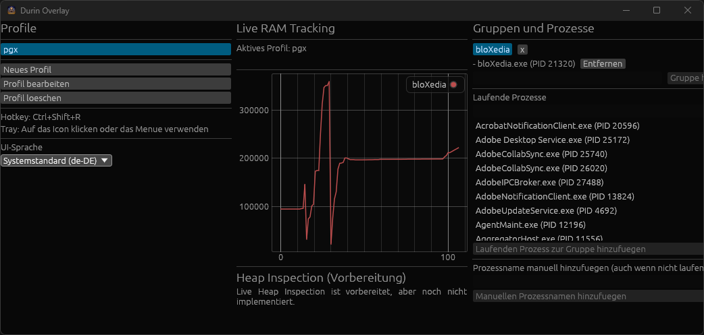
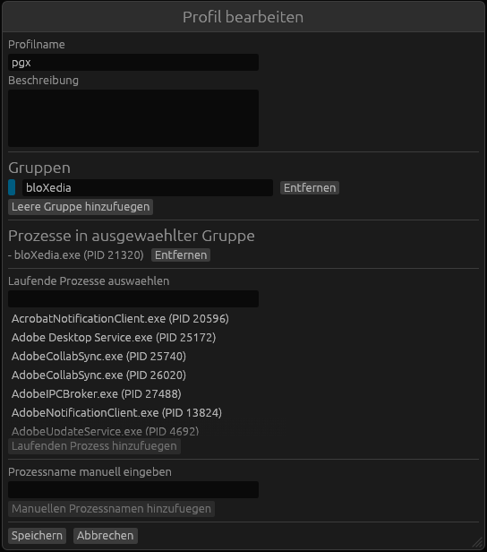
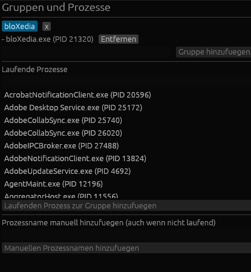
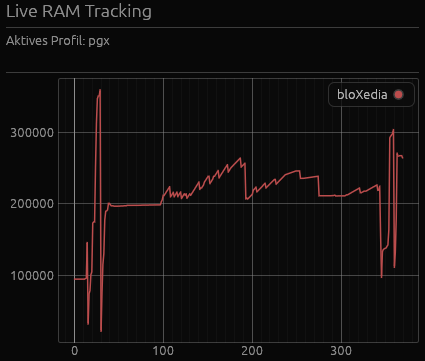
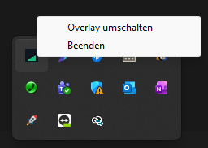

<p align="center">
  <a href="https://pommersche92.github.io/durin/"></a>
</p>

# Durin

> "Durin who was called the Deathless."
>
> *J.R.R. Tolkien, The Lord of the Rings (Appendix A)*

Durin is named after the legendary Dwarf-king of Khazad-dum, a symbol of depth, endurance, and mastery beneath the surface.

**Durin - The ultimate deep delver into heap layouts.**

Today, Durin already provides live, profile-based RAM tracking with an overlay, global toggle, and tray control. Tomorrow, it goes deeper: heap layout and allocation-path inspection for selected processes.

---

## Table of Contents

- [Why Durin](#why-durin)
- [Current Feature Set](#current-feature-set)
- [Platform Support](#platform-support)
- [Architecture Overview](#architecture-overview)
- [Getting Started](#getting-started)
- [Usage](#usage)
- [Profiles and settings.toml](#profiles-and-settingstoml)
- [Localization](#localization)
- [Screenshot Placeholders](#screenshot-placeholders)
- [Roadmap](#roadmap)
- [Changelog](#changelog)
- [Contributing](#contributing)
- [License](#license)

---

## Why Durin

Observability tools often stop at process-wide memory counters. Durin is built around the idea that practical diagnostics need a smooth path from:

1. **What is growing right now?** (live RAM trend)
2. **Which process group is responsible?** (profile/group model)
3. **What objects and allocation paths caused the growth?** (planned heap inspection)

Durin starts with low-friction, real-time RAM tracking and is intentionally architected to evolve into deep heap introspection without forcing a redesign.

---

## Current Feature Set

### Live Overlay

- Always-on-top desktop overlay window.
- Real-time RAM graph per configured process group.
- Lightweight polling with bounded in-memory sample history.

### Global Controls

- Global keyboard shortcut to toggle overlay visibility.
- System tray icon and menu support:
  - Toggle overlay
  - Quit application

### Profile-Based Tracking

- Multiple savable profiles in `settings.toml`.
- Profiles include:
  - Distinct profile name
  - Description
  - One or more process groups
- Group targets can be:
  - Running process selection (PID-based)
  - Manual process-name target (for currently not-running processes)

### Profile CRUD via UI

- Create profile
- Edit profile
- Delete profile
- Add/remove groups
- Add/remove targets in each group

### Future-Ready Heap Layer

- Stable trait abstraction for heap inspection backends.
- Stub backend already integrated in UI and app architecture.
- Clear extension points for Linux and Windows native implementations.

---

## Platform Support

### Supported Targets

- **Windows**
- **Linux** (broad distro coverage; behavior can vary by desktop/session)

### Notes

- Global hotkey/tray behavior on Linux may depend on session type (X11 vs Wayland) and desktop environment capabilities.
- Heap inspection is not implemented yet.

---

## Architecture Overview

Durin is organized to keep runtime orchestration, domain logic, and UI modular.



### Key Design Principles

- Keep UI pages in separate modules (`src/ui/pages`).
- Keep reusable controls in separate modules (`src/ui/controls`).
- Keep persistence centralized (`config.rs`).
- Keep future heap feature behind a backend trait (`heap.rs`).

---

## Getting Started

### Prerequisites

- Rust toolchain (stable)
- Cargo
- On Linux, typical desktop dependencies required by `eframe` and tray/hotkey crates

### Clone and Build

```bash
git clone <your-repo-url>
cd durin
cargo check
cargo build
```

### Run (development)

```bash
cargo run
```

### Build optimized release

```bash
cargo build --release
```

---

## Usage

### Quick Start

1. Launch Durin.
2. Create a new profile in the left panel.
3. Enter profile name and description.
4. Add one or more groups.
5. In each group, add processes:
   - select currently running process entries
   - or add manual process names for future matches
6. Save profile.
7. Watch live RAM graph updates in the center panel.

### Toggle Overlay

Default hotkey:

- `Ctrl+Shift+R`

Alternative controls:

- Tray icon click
- Tray menu action

### Typical Monitoring Scenarios

#### Scenario A: Browser + Tooling

- Group `Browser`: `chrome`, `firefox`, or selected browser PID
- Group `Dev Tools`: `code`, `rust-analyzer`, build processes

#### Scenario B: Service + Worker Stack

- Group `API`: process name of server binary
- Group `Workers`: worker process names, queue runners

#### Scenario C: Regression Tracking Session

- Profile `Leak Repro 2026-08-11`
- Description includes testcase and expected baseline
- Capture memory trend while reproducing workload

---

## Profiles and settings.toml

Durin persists profile and UI state in an operating-system specific `settings.toml` location.

### Default Locations

- Windows: `AppData/Roaming/durin/settings.toml`
- Linux: `~/.config/durin/settings.toml`

### Minimal Example

```toml
overlay_visible = true
hotkey = "Ctrl+Shift+R"
active_profile = "Daily Monitoring"

[[profiles]]
name = "Daily Monitoring"
description = "Track browser and IDE memory during development"

[[profiles.groups]]
name = "Browser"

[[profiles.groups.targets]]
display_name = "chrome (Name Match)"
process_name = "chrome"
pid = nil
manual = true

[[profiles.groups]]
name = "IDE"

[[profiles.groups.targets]]
display_name = "Code.exe (PID 12345)"
process_name = "Code.exe"
pid = 12345
manual = false
```

### Recommended Profile Naming Convention

- `context-purpose-date`
- Examples:
  - `frontend-loadtest-2026-08-11`
  - `service-leak-repro-v2`
  - `daily-dev-observability`

---

## Localization

Durin ships its bundled translations as embedded assets inside the executable.

That means:

- Release builds do not require loose `locales/*.toml` files next to the executable.
- Translations are loaded directly from memory at runtime.
- File-based locale loading is only used as an explicit override for translation work.

### Built-In Translation Source

- All files under `locales/` are embedded during build.
- Each file name must be a locale tag such as `en-GB.toml`, `de-DE.toml`, or `fr-FR.toml`.
- The file `locales/en-GB.toml` is the fallback locale and must always remain complete.

### Override Directory For Translation Work

To test translation changes quickly without rebuilding the executable, create a `locales/` directory next to the persisted `settings.toml` file.

Default override locations:

- Windows: `AppData/Roaming/durin/locales/`
- Linux: `~/.config/durin/locales/`

Example:

- Put `fr-FR.toml` into the override directory.
- Launch Durin.
- Select `fr-FR` as the UI language.
- Durin will prefer `AppData/Roaming/durin/locales/fr-FR.toml` or `~/.config/durin/locales/fr-FR.toml` over the embedded `fr-FR.toml`.

This is the intended workflow for active translation work because you can edit the TOML file, restart the app, and verify the changes immediately without rebuilding.

### Adding A New Language

When adding a new locale to the repository:

1. Copy `locales/en-GB.toml` to a new file such as `locales/fr-FR.toml`.
2. Translate values only; do not rename, remove, or invent keys unless the UI code changed as part of the same PR.
3. Keep locale file naming in BCP 47 style such as `fr-FR`, `it-IT`, or `pt-BR`.
4. Verify the new file parses as TOML and that the application can switch to it.
5. Check that fallback behavior still works if a key is temporarily missing.

### Translation PR Requirements

If you want a translation PR to be approved, it should include all of the following:

1. One complete locale file in `locales/` with the correct language tag in the filename.
2. Full key coverage matching `locales/en-GB.toml` at the time of the PR.
3. Natural, user-facing wording rather than machine-generated literal phrasing.
4. Confirmation that the translation was tested in the app, preferably via the override directory first and then with the embedded file in the branch.
5. Notes about anything that was ambiguous, intentionally untranslated, or difficult to localize.

### What Reviewers Will Check

Reviewers should normally only approve a new language PR when:

1. The locale file is complete and structurally consistent with `locales/en-GB.toml`.
2. The app can switch to the new locale without parse errors or missing-file failures.
3. The translation reads naturally in context for menus, buttons, status messages, and headings.
4. Key names, punctuation-sensitive values, and technical terms stay consistent with the rest of the project.
5. The PR description explains how the translation was validated.

---

## Screenshot Placeholders

Add real screenshots into `screenshots/` and keep these links unchanged.

### Overlay Overview



### Profile Editor



### Group and Process Assignment



### Live RAM Graph



### Tray Menu and Toggle



---

## Roadmap

Durin is being developed in layers from broad observability to deep memory diagnostics.

### Near Term

- [ ] Better graph UX (zoom range, smoothing toggles, per-group visibility)
- [ ] Configurable sampling interval and retention window
- [ ] Export snapshots to CSV/JSON
- [ ] Enhanced profile validation and duplicate target warnings

### Heap Inspection Milestone

- [ ] Implement real heap backend selection by platform
- [ ] Add process attach/permission diagnostics
- [ ] Capture heap summary snapshots per tracked target
- [ ] Visualize heap region composition in overlay
- [ ] Correlate RAM graph spikes with heap snapshot timelines
- [ ] Allocation-site attribution and leak candidate hints

### Longer Term

- [ ] Historical session storage and comparison
- [ ] Time-aligned event annotations in graph
- [ ] Plugin/backend interface for runtime-specific analyzers
- [ ] Optional remote target support (advanced)

---

## Changelog

### v0.1.0 (crates.io only) - 2026-08-12

Recent improvements since the initial baseline.

Changed:

- Added a proper Windows application icon for the executable and the main window.
- Release builds on Windows now open directly into the UI without showing a console window.
- Improved tray icon event handling for more reliable desktop controls.
- Embedded all shipped localization TOML files directly into the executable.
- Added an optional OS-config `locales/` override folder for rapid translation testing without rebuilding.
- Updated the project documentation and website from German to English for broader accessibility.
- Refined the website legal notice and contact details.
- Made the README icon clickable so it links directly to the project website.

### [Unreleased] - Initial public baseline. - 2026-08-11

Added:

- Modular UI architecture under `src/ui/pages` and `src/ui/controls`
- Overlay with live RAM graphing
- Global hotkey visibility toggle
- Tray icon/menu controls
- Profile management with create/edit/delete
- Group-based process target configuration
- Running process selection and manual target entry
- Persistent `settings.toml` storage model
- Heap inspection trait abstraction and explicit stub backend
- Extensive rustdoc comments across modules and functions

Known limitations:

- Heap inspection not yet implemented
- Linux tray/hotkey behavior depends on environment capabilities

---

## Contributing

Contributions are welcome.

Recommended workflow:

1. Open an issue describing your proposal.
2. Fork and create a focused feature branch.
3. Keep changes modular and include tests where practical.
4. Run:

```bash
cargo fmt
cargo clippy --all-targets --all-features
cargo test
```

5. Submit a pull request with motivation, implementation notes, validation steps, and screenshot updates if the UI changed.
6. For translation PRs, also include the locale code, key coverage confirmation, and how the translation was tested in the app.

---

## License

Durin is licensed under **GPL-3.0-only**.

See project metadata in `Cargo.toml` for current canonical license declaration.

---

## Name and Vision Recap

Durin is a memory observability tool that begins with clear live RAM insight and grows toward deep heap understanding.

If memory profiling tools are mountain maps, Durin is the delver that keeps going when the tunnels descend.
